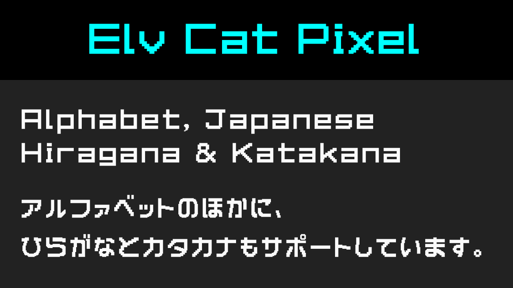
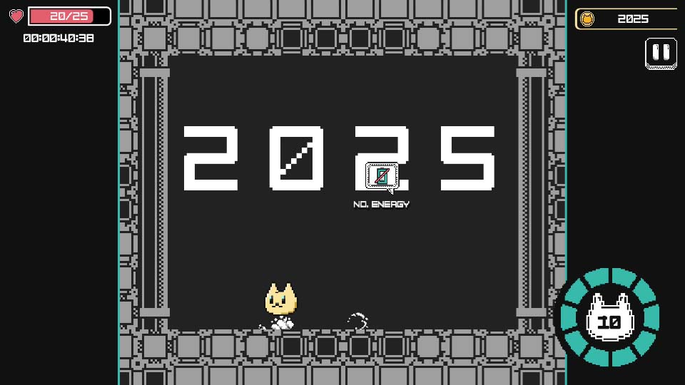
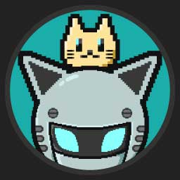

# Elv Cat Pixel フォント

__Elv Cat Pixel__ はElvCatDevのゲームプロジェクトのために作られたピクセルフォントです。

[Endlish README is here](/README.md)

### ダウンロードはこちら

[elvcatpixel.ttf](https://github.com/elvcatdev/ElvCatPixelFont/releases/download/v1.0/elvcatpixel.ttf)

### サポートしているグリフ
* アルファベット
* 数字や基本的な記号
* ひらがな
* カタカナ

## ライセンス
SIL Open Font License

ゲームやアプリや動画編集など、無料で商用利用が可能です。

## 活用事例

現在開発中のゲームプロジェクトに試しに組み込んでみました。

## 作者

__ElvNeko__

このリポジトリを訪れてくださりありがとうございます。
個人開発者として生計を立てております、ElvCatDevと申します。

自分のアプリやゲーム、アセットがあなたの創作活動に少しでも役立つことを願っております。

### SNSリンク

* [WEB](https://elvneko.com/)
* [YouTube](https://www.youtube.com/@ElvNeko)
* [Bluesky](https://bsky.app/profile/elvneko.com)
